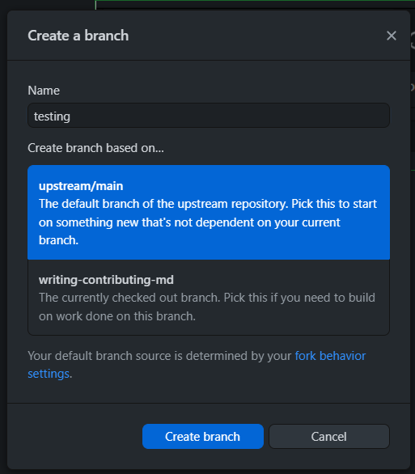
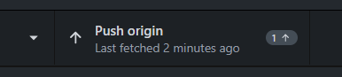
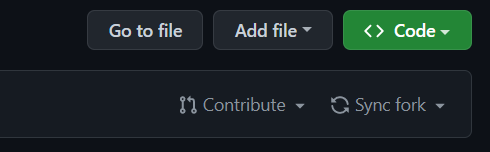
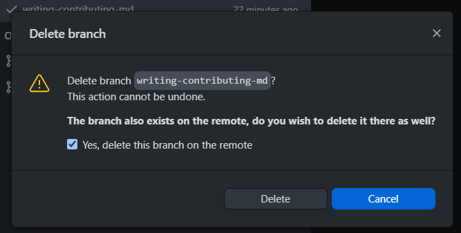

# Come contribuire al progetto

Sfogliate la lista degli issue aperti. Ciascuno fa riferimento ad un capitolo da scrivere ed all'interno è presente la task list con i relativi paragrafi. Cercatene qualcuno che non sia già stato scritto, dove nessuno ci sta già lavorando (se c'è accanto la scritta WIP allora il paragrafo (o il capitolo) sono già stati assegnati a qualcun altro) e soprattutto **che vi andrebbe di scrivere**.
Una volta trovato un paragrafo (o un capitolo) non assegnato potete aggiungere un commento sotto al relativo issue per specificare che intendete iniziare a lavorarci, in modo tale che noi potremo aggiungerlo tra quelli in lavorazione.

## Prerequisiti

Per poter contribuire al progetto è necessario installare i seguenti tool:

- [node.js](https://nodejs.org) (vanno bene entrambe le versioni disponibili: LTS e Current)
- [Github CLI](https://cli.github.com/manual/installation) o, alternativamente, [Github Desktop](https://docs.github.com/en/desktop/installing-and-configuring-github-desktop/installing-and-authenticating-to-github-desktop/installing-github-desktop) (si tratta di un'interfaccia grafica con le funzionalità di Github CLI)
- [git](https://git-scm.com/book/en/v2/Getting-Started-Installing-Git) (quest'ultimo è già presente nella maggior parte delle distribuzioni di Linux)

Il primo è un runtime di JavaScript che permette di eseguire lo script (`esporta.js`) che converte il Markdown in un PDF pronto per essere stampato; gli altri sono necessari per creare e gestire la propria copia del progetto (sia in locale che su Github) e poter proporre modifiche all'originale tramite le pull request.

In seguito spiegheremo come utilizzare i tool, sia nel caso abbiate installato Github CLI, che nel caso abbiate installato Github Desktop.

## Con Github CLI

- ### Autenticazione

Per prima cosa sarà necessario effettuare il login (con le vostre credenziali di Github) su Github CLI attraverso il seguente comando.

```bash
gh auth login
```

Vi si presenteranno dei menù a scelta multipla, quando verrà richiesto il sito su cui autenticarvi selezionate Github.com.
Successivamente, per semplicità, consigliamo di scegliere il login attraverso web browser.

Seguite il processo di login inserendo i dati richiesti.

Quando sarà richiesto quale protocollo scegliere come default, consigliamo HTTPS.

- ### Fare una fork della repository

Una volta configurati correttamente i tool, vogliamo effettuare una fork del progetto: una repository clonata che apparirà sul vostro profilo Github e che sarà scaricata anche in locale.

Spostatevi nella cartella dove intendete scaricare il progetto.
Ad esempio:

```bash
cd ~/Progetti
```

La seguente operazione creerà la cartella `ing-sw-cheatsheet` all'interno della cartella dove vi siete posizionati. Forkiamo la repository:
```bash
gh repo fork m1gwings/ing-sw-cheatsheet --clone
```
L'opzione `--clone` specifica che non solo volete creare una copia del progetto sul vostro account Github, ma che volete scaricare questa copia anche in locale.

- ### Installazione delle librerie necessarie

Spostatevi all'interno della nuova cartella creata:
```bash
cd ing-sw-cheatsheet
```

Per poter testare lo script di esportazione è necessario installare le libreria che utilizza, sarà sufficiente lanciare il comando:
```bash
npm i
```

- ### Esportazione del PDF

Siamo pronti per l'esportazione.
Lanciate lo script:
```bash
node esporta.js
```

Al termine dell'esecuzione il file `cheatsheet.pdf` dovrebbe comparire all'interno della cartella. Complimenti! Avete esportato il PDF con successo.

- ### Modificare il progetto

Per mantenere una certa uniformità nel progetto, consultate il [paragrafo](./CONTRIBUTING.md#convenzioni-e-stile) sulle convenzioni e lo stile da adottare.

Prima di iniziare a modificare il progetto occorre creare un nuovo branch: questo vi permetterà di poter aggiornare periodicamente la storia del branch principale (`main`) senza che ciò su cui state lavorando (all'interno del vostro branch) ne risenta.

Ciascun branch ha un nome, chiamate il nuovo branch descrivendo il contenuto che volete aggiungere, ad esempio: `design-pattern-strategy`.
Per creare un branch si utilizza il seguente comando:
```bash
git checkout -b <nome-branch>
```

Il nuovo branch è stato creato solo sulla copia locale della vostra repository; per salvare le modifiche su Github ed evitare di poterle perdere è necessario creare il branch anche in remoto:
```bash
git push -u origin <nome-branch>
```

Quando ritenete di voler salvare nella storia della repository (sulla **vostra** copia del progetto, sia in locale che in remoto) le modifiche che avete apportato sarà necessario effettuare un commit.
Innanzitutto occorre specificare quali dei file che avete modificato volete salvare, a meno che non abbiate aggiunto dei file senza uno scopo all'interno della cartella (consigliamo di evitarlo), potete specificare di voler salvare tutti i file:
```bash
git add .
```

Siamo pronti per salvare:
```bash
git commit
```

Ora vi si aprirà il vostro text editor di default da terminale. La prima riga che vi scriverete sarà il titolo del commit, le righe successive costituiranno la descrizione. Cercate di specificare brevemente ma in maniera esaustiva le modifiche apportate (sia tramite il titolo, che con la descrizione). Una volta terminato dovete uscire dal text editor, purtroppo questa operazione si effettua in modo diverso a seconda del text editor e noterete che risulta molto più complicata di quello che dovrebbe essere.

Elenchiamo due metodi che funzionano rispettivamente per `vi` e `nano`:
- `vi`: Premete `Esc` e provate ad inserire `:wq` e premere invio (dopo aveer premuto `Esc` se il text editor che state usando è effettivamente `vi`, il cursore si dovrebbe spostare in basso, nella barra dove si inseriscono i comandi)
- `nano`: Premete `Ctrl + x`

Ora dovremo salvare le modifiche apportate alla storia del vostro branch su Github:
```bash
git push
```

- ### Mantenere la propria copia aggiornata

Mentre lavorate alla vostra modifica, altri contributors potrebbero modificare il progetto principale. Per mantenere aggiornata la vostra versione del progetto utilizzate i seguenti comandi.

Per controllare se vi sono state modifiche:
```bash
git fetch
```

Per scaricare le eventuali modifiche:
```bash
git pull
```

Per le motivazioni spiegate precedentemente, l'unico branch su cui potreste trovare delle modifiche è il `main`, il vostro branch rimarrà inalterato.

- ### Aprire una pull request

Una volta che la modifica che volevate apportare è stata completata, è il momento di proporla perchè venga aggiunta al progetto originale. Per fare questo apriremo una pull request.

Prima però è bene aggiornare il branch `main`, come spiegato in precedenza, e cercare di minimizzare i conflitti con il branch su cui avete lavorato. Il seguente comando cercherà di apportare le modifiche del vostro branch (fatte a partire da quando l'avete creato) all'ultima versione del `main`:
```bash
git rebase main
```

Il comando potrebbe segnalare dei conflitti nel caso in cui abbiate lavorato su un file che è stato anche modificato nel `main`. Se non siete molto familiari con `git`, annullate l'operazione ed aprite direttamente la pull request senza risolvere i conflitti, ce ne preoccuperemo noi in fase di accettazione.

Nel caso in cui abbiate effettuato l'operazione di rebase con successo, dovrete (come al solito) aggiornare anche la vostra copia in remoto. Controllate prima che il lavoro fatto non sia andato perso. Una volta che vi siete assicurati di ciò, dovrete sovrascrivere la storia del vostro branch in remoto; dopo aver effettuato il rebase le due store sono incompatibili:
```bash
git push -f
```

Possiamo finalmente aprire la pull request:
```bash
gh pr create
```
Selezionate nel menù la `repository m1gwings/ing-sw-cheatsheet`; poi potete premere invio ripetutamente per skippare la compilazione degli altri campi e lasciare i valori di default.

- ### Cancellare il branch relativo ad una modifica

Una volta che la pull request è stata accettata potete cancellare il branch che avevate creato appositamente per la modifica (la modifica ora è disponibile sul main). Prima di tutto tornate sul branch `main`:
```bash
git checkout main
```

Ora cancellate il branch relativo alla modifica:
```bash
git branch -d <nome-branch>
```
Se non ricordate il nome del branch, il comando `git branch` mostra una lista di tutti i branch della repository.

E cancellatelo anche da Github:
```bash
git push origin --delete <nome-branch>
```

- ### Passare alla prossima modifica

Ogni volta che volete aggiungere una modifica dovete ripetere il procedimento descritto a partire dalla creazione del branch.
**Ricordate di aggiornare il main (per semplificare il rebase) e di creare il nuovo branch dopo esservi posizionati sul main con `git checkout main`**.

---

## Con Github Desktop (solo per Windows e macOS)

- ### Installazione e Autenticazione

Procedete (se non l'avete già fatto) con l'installazione di Github Desktop dal [sito ufficiale](https://desktop.github.com/). 

Una volta installato autenticatevi con le vostre credenziali Github andando su File > Options > Accounts.

- ### Fork e Clone del progetto

Forkate il progetto andando sulla [pagina del progetto](https://github.com/m1gwings/ing-sw-cheatsheet) premendo su Fork in alto a destra.

Clonate la repository appena forkata, andando su Github Desktop e successivamente: File > Clone repository..., selezionate la repository di nome `ing-sw-cheatsheet`, impostate la cartella di destinazione e cliccate su Clone.

- ### Setup del progetto

Aprite la cartella del progetto, aprite il terminale e installate le dipendenze con il comando:

```bash
npm i
```

Dopo aver installato le dipendenze, provate a esportare il progetto in PDF con il comando:

```bash
node esporta.js
```

Se tutto è andato a buon fine, verrà generato il PDF `cheatsheet.pdf` nella stessa cartella.

- ### Contribuzione e creazione di una nuova feature

Per mantenere una certa uniformità nel progetto, consultate il [paragrafo](./CONTRIBUTING.md#convenzioni-e-stile) sulle convenzioni e lo stile da adottare.

Per contribuire al progetto, prima di tutto, creiamo un nuovo branch per la feature che stiamo implementando (immaginando quindi di voler implementare il capitolo sul testing, il nome del branch che aggiungeremo sarà qualcosa di simile a `testing`).

Per aggiungere un nuovo branch, andate su Github Desktop e cliccate su Current branch > New branch... e inserite il nome del branch.



Switchate al nuovo branch appena creato, andando su Current branch e selezionando il branch appena creato. Dobbiamo ora aggiungere il branch alla repository in remoto cliccando su Publish branch (affianco a Current branch).

Possiamo ora iniziare a lavorare sulla nuova feature. Una volta terminata, salvate le modifiche e andate su Github Desktop. In alto a sinistra, nella sezione Changes, vedrete le modifiche che avete appena apportato. Selezionate le modifiche che volete aggiungere al progetto e cliccate sul pulsante `Commit to <nome-branch>` in basso a sinistra (è importante aggiungere un titolo e una descrizione su cosa avete modificato/aggiunto).

Dobbiamo ora pushare i cambiamenti sulla repository in remoto, cliccate su Push origin in alto a destra.



- ### Creazione della pull request

Ci occupiamo ora di aggiornare la repository originale con le modifiche che abbiamo appena apportato. Per farlo, andiamo su Branch > Create pull request, vi si aprirà la pagina di Github con la pull rquest da submittare. Potete, quindi, aggiungere eventuali commenti e cliccare su Create pull request.

Se tutto è andato a buon fine, la pull request verrà accettata e la vostra feature verrà aggiunta al progetto.

- ### Aggiornamento della repository forkata

Può succedere che, nel frattempo scriviate la vostra feature, la repository originale abbia subito delle modifiche (le pull request di altri utenti sono state accettate  e mergiate sul main nel repository principale). Bisogna quindi aggiornare periodicamente la vostra repository forkata, soprattutto quando la vostra pull request viene accettata e mergiata. Per aggiornare la vostra repository remota, andate sulla pagina web della vostra repository e cliccate su `Sync fork`.



Una volta fatto ciò, andate su Github Desktop e cliccate su `Fetch origin` in alto a destra. Se vi sono cambiamenti il tasto diventerà `Pull origin`, quindi cliccatelo. Il vostro progetto in locale è quindi aggiornato.

- ### Eliminazione del vecchio branch

La nostra feature è stata implementata nel main ed è presente sia nel repository principale che nel nostro repository forkato. Possiamo quindi switchare sul branch main ed eliminare il vecchio branch dal nostro repository locale e remoto. Per farlo, andate su Github Desktop e andate su Current branch > Tasto destro sul branch che abbiamo creato per implementare la feature > Delete... > Spuntate la casella `Yes, delete this branch on the remote` > Delete.



## Convenzioni e stile

In generale è sufficiente seguire il buon senso e le convenzioni basilari del Markdown.
Iniziata la stesura di un nuovo capitolo con
```markdown
# Titolo del capitolo
```
con un solo cancelletto.

Ogni volta che aggiungete un paragrafo e poi via via sottoparagrafi annidati: aggiungete un cancelletto:
```markdown
# Titolo del capitolo
...
## Primo paragrafo
...
### Sottoparagrafo del primo paragrafo
...
```

Per aggiungere immagini, elenchi, porzioni di codice sarà sufficiente scrivere i relativi costrutti del Markdown standard.
In particolare per i diagrammi UML non serve aggiungere immagini, bensì potete utilizzare il plugin `mermaid` (che estende il normale Markdown) descritto in seguito.

### Come aggiungere nuove pagine ad un capitolo

Il testo che avete scritto sfora oltre il foglio?
Nessun problema. Sarà sufficiente aggiungere una nuova pagina al capitolo con
```markdown

---

```
Lasciate una riga bianca sopra e sotto come indicato.

Questa funzionalità è un'aggiunta al Markdown standard (che non prevede la divisione in pagine) dovuta ad un plugin esterno.

### Come aggiungere diagrammi UML con `mermaid`

Per aggiungere i diagrammi UML fate riferimento alla [documentazione](https://mermaid-js.github.io/mermaid/syntax/classDiagram.html) del plugin `mermaid`.

In particolare dovrete racchiudere il codice mermaid (che segue la sintassi specificata nella documentazione) in un blocco come quello che segue:
<br>
\`\`\`mermaid<br>
Codice mermaid...<br>
\`\`\`
