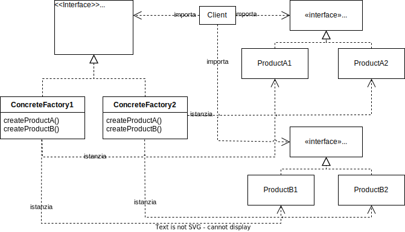
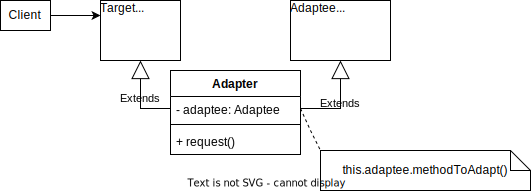
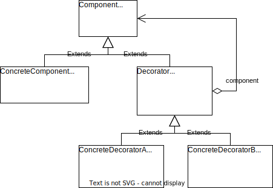
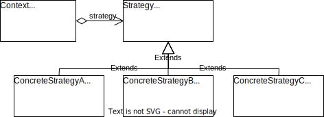
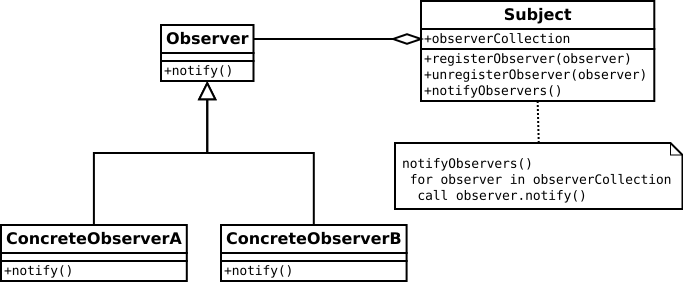

# Design pattern

I design pattern sono dei modelli di soluzione a problemi comuni di progettazione software. Esistono diversi tipi di design pattern, ma in generale si possono suddividere in 4 categorie: _creazionali, strutturali, comportamentali e architetturali_.

## Pattern creazionali

I design pattern creazionali sono quelli che si occupano di risolvere problemi relativi alla _creazione di oggetti_.

### Factory Method

Il **Factory Method** permette di creare oggetti senza specificare la loro classe concreta. Questo pattern è particolarmente utile quando abbiamo bisogno di istanziare uno o più oggetti astratti per poi effettuarvi delle operazioni che non dipendono dal loro tipo concreto (uguale per tutti gli oggetti). Come è ben noto non è possibile costruire un oggetto astratto. Per ovviare a questo problema si usa il **Factory Method** che permette al Client di specificare al metodo che dovrà effettuare tali operazioni, solo la _factory_ con cui costruire gli oggetti astratti, il metodo poi potrà lavorare con gli oggetti astratti e non sarà necessario creare un metodo diverso (che effettua le stesse operazioni) per ciascun tipo concreto, solo per avere accesso al costruttore del tipo concreto in questione.

#### UML


Nell'UML, la classe astratta `Creator`, che ha bisogno di creare un oggetto `Product`, delega la creazione ad una classe `ConcreteCreator` (che estende `Creator`). La classe `ConcreteCreator` implementa il metodo `factoryMethod()` che crea un oggetto `ConcreteProduct` (che estende `Product`).

#### Esempio

Supponiamo di voler creare un programma per creare dei documenti. Il programma deve essere in grado di creare documenti di diversi tipi (documenti di testo, di calcolo, pdf, ...) decisi a runtime dall'utente. Il programma non può prevedere che tipo di documento l'utente deciderà di creare, quindi il **Factory Method** è la soluzione migliore.

```java
public abstract class Document {
  private String title;

  public abstract void
    setTitle(String title);
  ...
}

public class TextDocument extends Document {
  @Override
  public void setTitle(String title) {
    this.title = title + ".txt";
  }
  ...
}

public class PDFDocument extends Document {
  @Override
  public void setTitle(String title) {
    this.title = title + ".pdf";
  }
  ...
}

public abstract class DocumentFactory {
  public abstract Document createDocument();
}

public class TextDocumentFactory 
extends DocumentFactory {
  @Override
  public Document createDocument() {
    return new TextDocument();
  }
}

public class PDFDocumentFactory 
extends DocumentFactory {
  @Override
  public Document createDocument() {
    return new PDFDocument();
  }
}

public class Main {
  /* Crea n documenti dello stesso tipo 
  e ne setta il titolo */
  private Document[] createNDocuments
  (int n, DocumentFactory factory) {
    Document[] documents=new Documents[n];
    for (int i = 0; i < n; i++) {
      documents[i] 
        = factory.createDocument();
        documents[i]
          .setTitle(String.valueOf(i));
      }

      return documents;
  }

  public static void main(String[] args) {
    Document[] docs;
    DocumentFactory factory;

    // Creazione di n documenti di testo
    factory = new TextDocumentFactory();
    docs = createNDocuments(10, factory);

    // Creazione di n documenti PDF
    factory = new PDFDocumentFactory();
    docs = createNDocuments(5, factory);
  }
}
```

In questo modo, il metodo nel `Main` crea n documenti allo stesso modo, senza dover conoscere il tipo di documento da creare, grazie al **Factory Method** che richiama il metodo `createDocument()`. Sarà il Client a decidere quale _factory_ inserire nel metodo `createNDocuments()`.
Senza il **Factory Method**, ci sarebbero stati diversi metodi `createNDocuments()` per ogni tipo di documento.

---

### Abstract Factory

A differenza del Factory Method, l'**Abstract Factory** permette di creare _famiglie_ di oggetti correlati senza specificare la loro classe concreta.

#### UML



In questo diagramma, si hanno 2 famiglie di oggetti: `AbstractProductA` e `AbstractProductB`, e i rispettivi prodotti concreti `ProductA1`, `ProductA2`, `ProductB1` e `ProductB2`. La classe astratta `AbstractFactory` ha bisogno di creare una famiglia di oggetti, e delega la creazione a 2 classi concrete `ConcreteFactory1` e `ConcreteFactory2`. Le classi concrete implementano i metodi `createProductA()` e `createProductB()` che creano rispettivamente un oggetto `ProductA1` o `ProductA2`, e un oggetto `ProductB1` o `ProductB2`. Il Client, che ha bisogno di creare una famiglia di oggetti, crea una classe `ConcreteFactory` e usa i metodi `createProductA()` e `createProductB()` per creare la famiglia di oggetti.

#### Esempio

Supponiamo di implementare un insieme di classi dedicate alla creazione di interfacce grafiche. I diversi elementi grafichi possono essere creati secondo stili diversi (PM e Motif). Per ogni elemento grafico viene creata una classe astratta, per ogni stile ed elemento grafico viene creata una classe concreta. Il Client deve essere in grado di modificare lo stile dell'interfaccia grafica a runtime, senza dover modificare il codice.

```java
public interface Button { /* ... */ }

public interface ScrollBar { /* ... */ }

public interface GUIFactory {
  public Button createButton();
  public ScrollBar createScrollBar();
}

public class PMButton 
  implements Button { /* ... */ }

public class PMScrollBar 
  implements ScrollBar { /* ... */ }

public class PMGUIFactory 
  implements GUIFactory {
  @Override
  public Button createButton() {
    return new PMButton();
  }

  @Override
  public ScrollBar createScrollBar() {
    return new PMScrollBar();
  }
}

public class MotifButton 
  implements Button { /* ... */ }

public class MotifScrollBar 
  implements ScrollBar { /* ... */ }

public class MotifGUIFactory 
  implements GUIFactory {
  @Override
  public Button createButton() {
    return new MotifButton();
  }

  @Override
  public ScrollBar createScrollBar() {
    return new MotifScrollBar();
  }
}

public class Main {
  public static void main(String[] args) {
    GUIFactory factory;
    Button button;
    ScrollBar scrollBar;

    // Creazione interfaccia grafica PM
    factory = new PMGUIFactory();
    button = factory.createButton();
    scrollBar = factory.createScrollBar();

    // Creazione interfaccia grafica Motif
    factory = new MotifGUIFactory();
    button = factory.createButton();
    scrollBar = factory.createScrollBar();
  }
}
```

In questo modo, il `Main` crea solo la classe `ConcreteFactory` della famiglia richiesta dall'utente e richiama i metodi generici `createButton()` e `createScrollBar()` per creare la famiglia di oggetti, ma sarà la `ConcreteFactory` a preoccuparsi di creare gli oggetti della famiglia corretta.

---

## Pattern strutturali

I pattern strutturali sono quelli che si occupano di come le classi e gli oggetti vengono composti per formare strutture più grandi.

### Adapter

L'**Adapter** è un pattern che permette di adattare un'interfaccia ad un'altra. Supponiamo di voler implementare una feature e, per farlo, ci serviamo di una libreria esterna. La libreria, però, lavora su dati e oggetti diversi da quelli con cui lavoriamo noi. In questo caso, possiamo creare un **Adapter** che si occupa di _adattare_ l'interfaccia della libreria esterna all'interfaccia che usiamo.

#### UML



In questo diagramma, abbiamo `Target` che definisce l'interfaccia che il Client usa, `Adaptee` che definisce l'interfaccia che vogliamo _adattare_ (ad esempio una libreria esterna), e `Adapter`, che estende `Target`, e usa `Adaptee` per adattare il methodo `methodToAdapt()` al metodo `request()` di `Target`.

#### Esempio

Supponiamo di voler implementare un programma che legge un file di testo e lo stampa a video. Per farlo, usiamo una libreria esterna, che però lavora su oggetti diversi da quelli che usiamo noi. In questo caso, possiamo creare un **Adapter** che si occupa di _adattare_ l'interfaccia della libreria esterna all'interfaccia che usiamo.

Per prima cosa, definiamo l'interfaccia `Target`, in questo esempio la chiamiamo `TextPrinter`, che lavora con il tipo di file `TextFile`:

```java
public class TextFile {
  private String name;
  private String path;
  private int size;

  public TextFile
  (String name, String path, int size) {
    this.name = name;
    this.path = path;
    this.size = size;
  }

  public String getPath() {
    return path;
  }
  
  ...
}

public interface TextPrinter {
  public void printText(TextFile textFile);
}
```

Definiamo anche l'interfaccia `Adaptee` (la libreria esterna), in questo esempio la chiamiamo `FilePrinterLibrary`, che userà un tipo di file diverso da `TextFile` (`File`):

```java
public class File {
  private String path;

  public File(String path) {
    this.path = path;
  }

  public String getPath() {
    return path;
  }

  ...
}

public class FilePrinterLibrary {
  public void printFile(File file) {
    System.out.println(
      "Printing file " + file.getPath());
  }
}
```

`TextPrinter` e `FilePrinterLibrary` lavorano con oggetti diversi, quindi, per adattare l'interfaccia di `FilePrinterLibrary` a quella di `TextPrinter`, creiamo un **Adapter**:

```java
public class FilePrinterLibraryAdapter
implements TextPrinter {
  FilePrinterLibrary filePrinterLibrary =
    new FilePrinterLibrary();

  @Override
  public void printText(TextFile textFile) {
    File file=new File(textFile.getPath());

    filePrinterLibrary.printFile(file);
  }
}
```

`FilePrinterLibraryAdapter` definisce il metodo `printText()` per poter implementare l'interfaccia `TextPrinter`. Implementiamo il metodo `printText()` utilizzando un oggetto `FilePrinterLibrary` e creando un oggetto `File` a partire da un oggetto `TextFile`, quindi possiamo chiamare il metodo `printFile()` di `FilePrinterLibrary`.

```java
public class Main {
  public static void main(String[] args) {
    TextFile textFile = new TextFile(
      "test.txt", "/home/user", 100
    );

    TextPrinter textPrinter = 
      new FilePrinterLibraryAdapter();

    textPrinter.printText(textFile);
  }
}
```

In questo modo, il `Main` usa il tipo di file `TextFile`, sarà poi l'**Adapter** che si occuperà di convertirlo in `File` per richiamare la funzione di libreria.

---

<!-- _class: due -->

### Decorator

Il **Decorator** è un pattern che permette di aggiungere dinamicamente una o più funzionalità ad un sistema.

#### UML



In questo diagramma, abbiamo `Component` che definisce l'interfaccia che il Client usa, `ConcreteComponent` che implementa `Component`, e `Decorator` che estende `Component` e usa `Component` per aggiungervi funzionalità, vi sono poi i vari `ConcreteDecorator` che estendono `Decorator` e realizzano (ciascuno) una funzionalità.

Si noti che l'attributo `component` di `Decorator` è di tipo `Component`, e non deve essere per forza un `ConcreteComponent`, ma anche un altro `Decorator` (`ConcreteDecoratorA` o `ConcreteDecoratorB`), che a sua volta avrà di nuovo un `component`. Si può quindi aggiungere quante funzionalità si vogliono al `ConcreteComponent` _base_.

#### Esempio

Supponiamo di voler costruire un programma che gestisce un'interfaccia per la visualizzazione di un testo. Il programma deve essere in grado di visualizzare il testo in modo semplice, in grassetto, ma anche cambiando il colore del testo, o tutti e due insieme. Per farlo, usiamo un **Decorator**.

Per prima cosa, definiamo l'interfaccia `Component`, in questo esempio la chiamiamo `TextView`, che definisce il metodo `draw()`:

```java
public interface TextView {
  public void draw();
}
```

Definiamo anche la classe `ConcreteComponent`, in questo esempio la chiamiamo `SimpleTextView`, che implementa `TextView` (e stamperà semplicemente il testo che gli viene passato):

```java
public class SimpleTextView implements TextView {
  private String text;

  public SimpleTextView(String text) {
    this.text = text;
  }

  @Override
  public void draw() {
    System.out.println(text);
  }
}
```

Definiamo la classe astratta `Decorator`, in questo esempio la chiamiamo `TextViewDecorator`, che estende `TextView` e usa `TextView` per aggiungere funzionalità:

```java
public abstract class TextViewDecorator implements TextView {
  private TextView textView;

  public TextViewDecorator(TextView textView) {
    this.textView = textView;
  }

  @Override
  public void draw() {
    textView.draw();
  }
}
```

L'attributo `textView` di `TextViewDecorator` è di tipo `TextView`, e (come detto prima) può essere sia un `SimpleTextView` che un altro `ConcreteDecorator`.

---

<!-- _class: due -->

Definiamo le classi `ConcreteDecoratorA`, in questo esempio la chiamiamo `ColoredTextView`; e `ConcreteDecoratorB`, in questo esempio la chiamiamo `BoldTextView`, che estendono `TextViewDecorator`:

```java
public class ColoredTextView extends TextViewDecorator {
  private String color;

  public ColoredTextView(TextView textView, String color) {
    super(textView);
    this.color = color;
  }

  // Stampa il testo colorato
  @Override
  public void draw() {
    System.out.print(color);
    super.draw();
    System.out.print("\u001B[0m");
  }
}
```

```java
public class BoldTextView extends TextViewDecorator {
  public BoldTextView(TextView textView) {
    super(textView);
  }

  // Stampa il testo in grassetto
  @Override
  public void draw() {
    System.out.print("\u001B[1m");
    super.draw();
    System.out.print("\u001B[0m");
  }
}
```

Si noti che `ColoredTextView` e `BoldTextView` hanno nel loro costruttore l'istruzione `super(textView)`, che chiama il costruttore di `TextViewDecorator` per settare l'attributo `textView` (che può essere sia un `SimpleTextView` che un `ColoredTextView` o un `BoldTextView`).

```java
public class Main {
  public static void main(String[] args) {
    // Stampa "Hello World!" normale
    TextView textView = new SimpleTextView("Hello World!");
    textView.draw();

    // Stampa "Hello World!" in rosso
    TextView coloredTextView = new ColoredTextView(
      new SimpleTextView("Hello World!"), "\u001B[31m");
    coloredTextView.draw();

    // Stampa "Hello World!" in grassetto
    TextView boldTextView = new BoldTextView(
      new SimpleTextView("Hello World!"));
    boldTextView.draw();

    // Stampa "Hello World!" in rosso e in grassetto
    TextView coloredBoldTextView = new ColoredTextView(
      new BoldTextView(
        new SimpleTextView("Hello World!")
      ), 
      "\u001B[31m"
    );
    coloredBoldTextView.draw();
  }
}
```

Con questa _catena_ di **Decorator** è possibile aggiungere dinamicamente più funzionalità al `SimpleTextView` _base_.

---

## Pattern comportamentali

### Strategy

**Strategy** è un pattern che permette di cambiare dinamicamente il comportamento di un sistema.

#### UML



In questo diagramma, troviamo `Strategy` che definisce un comportamento che le varie `ConcreteStrategy` implementano, ognuno in modo diverso. `Context` usa una `Strategy` _generica_, che verrà assegnata dinamicamente dal client attraverso una `ConcreteStrategy`.
Si noti che `Strategy` e `ConcreteStrategy` sono classi che hanno un solo metodo, sono quindi **interfacce funzionali**. Possiamo quindi usare le **espressioni lambda** per definire le `ConcreteStrategy` senza doverle creare esplicitamente.

#### Esempio (senza interfacce funzionali)

Supponiamo di voler gestire un sistema di apertura di casse in un gioco. Le casse possono dare, una volta aperte, degli effetti al giocatore che le apre; ad esempio, una cassa può curare il giocatore, un'altra può avvelenarlo, ecc. 
Usiamo uno **Strategy**.
Per prima cosa, definiamo l'interfaccia `Strategy`, in questo esempio la chiamiamo `EffettoCassa`, che definisce il metodo `applicaEffetto()`:

```java
public interface EffettoCassa {
  public void applicaEffetto();
}
```

Definiamo le varie classi `ConcreteStrategy`, in questo esempio le chiamiamo `EffettoCassaCurativa`, `EffettoCassaAvvelenata`, ecc., che implementano `EffettoCassa`:

```java
public class EffettoCassaCurativa 
implements EffettoCassa {
  @Override
  public void applicaEffetto() {
    System.out.println("Sei stato curato!");
  }
}
```

```java
public class EffettoCassaAvvelenata 
implements EffettoCassa {
  @Override
  public void applicaEffetto() {
    System.out.println("Sei avvelenato!");
  }
}
```

Definiamo la classe `Context`, in questo esempio la chiamiamo `Cassa`, che usa un `EffettoCassa` _generico_ e chiama il metodo `apri()`:

```java
public class Cassa {
  private EffettoCassa effettoCassa;

  public Cassa(EffettoCassa effettoCassa) {
    this.effettoCassa = effettoCassa;
  }

  public void apri() {
    effettoCassa.applicaEffetto();
  }
}
```

Il Main poi assegnerà una `ConcreteStrategy` (`EffettoCassaCurativa`, `EffettoCassaAvvelenata`, ecc.) a quella _generica_ (`EffettoCassa`) nel costruttore di `Cassa`.

#### Esempio (con interfacce funzionali)

Usando le interfacce funzionali, possiamo usare una sola classe `Cassa`:

```java
public class Cassa {
  Runnable effettoCassa;

  public Cassa(Runnable effettoCassa) {
    this.effettoCassa = effettoCassa;
  }

  public void apri() {
    effettoCassa.run();
  }
}
```

Per il nostro uso, definiamo una `Runnable`, che è un'interfaccia funzionale che ha un solo metodo: `run()` per eseguire il codice. A seconda dei tipi dei parametri e del tipo del valore restituito, possiamo usare anche le altre interfacce funzionali spiegate nel capitolo "Programmazione funzionale".
Il `Main` può quindi definire le `Runnable` _concrete_ tramite espressioni lambda e, richiamando il costruttore di `Cassa`, assegnarle a quella _generica_ per eseguire il giusto comportamento:

```java
public class Main {
  public static void main(String[] args) {
    // Crea una cassa curativa
    Cassa cassaCurativa = 
    new Cassa(() -> {
      System.out.println("Sei stato curato!");
    });
    /* equivalente a:
    Runnable effettoCassaCurativa = () -> {
      System.out.println("Sei stato curato!");
    };
    Cassa cassaCurativa = 
      new Cassa(cassaCurativa);
    */

    // Crea una cassa avvelenata
    Cassa cassaAvvelenata = 
    new Cassa(() -> {
      System.out.println("Sei avvelenato!");
    });

    // Apri le casse curativa e avvelenata
    cassaCurativa.apri();
    cassaAvvelenata.apri();
  }
}
```

---

### Observer

**Observer** è un pattern che permette di notificare un oggetto quando un altro oggetto cambia.

#### UML



In questo diagramma, troviamo `Subject` che è l'oggetto che cambia e notifica gli `Observer`; gli `Observer` che ricevono la notifica e si comportano conseguentemente. Infine abbiamo i `ConcreteObserver` che implementano `Observer` e definiscono il comportamento che si attiva quando `Subject` cambia. Inoltre `Subject` può essere astratta ed avere una `ConcreteSubject` che la estende.

#### Esempio

Supponiamo di voler costruire un sistema di gestione di dati di un'azienda. L'azienda ha un database che contiene i dati dei dipendenti, e un sistema che permette di visualizzare questi dati. Il sistema di visualizzazione deve essere aggiornato ogni volta che il database cambia. Usiamo un **Observer**.

Per prima cosa, definiamo l'interfaccia `Observer`, in questo esempio la chiamiamo `Visualizzazione`, che definisce il metodo `aggiorna()`:

```java
public interface Visualizzazione {
  public void aggiorna();
}
```

Definiamo le varie classi `ConcreteObserver`, in questo esempio le chiamiamo `VisualizzazioneConsole`, `VisualizzazioneGUI`, ecc., che implementano `Visualizzazione`:

```java
public class VisualizzazioneConsole 
implements Visualizzazione {
  @Override
  public void aggiorna() {
    System.out.println(
      "Aggiornamento della 
      visualizzazione console");
  }
}
```

```java
public class VisualizzazioneGUI 
implements Visualizzazione {
  @Override
  public void aggiorna() {
    System.out.println(
      "Aggiornamento della 
      visualizzazione GUI");
  }
}
```

Definiamo la classe `Subject`, in questo esempio la chiamiamo `Database`, che ha un `ArrayList` di `Visualizzazione` e un metodo `aggiornaVisualizzazioni()` che chiama il metodo `aggiorna()` di ogni `Visualizzazione`:

```java
public class Database {
  private ArrayList<Visualizzazione> 
    visualizzazioni;

  public Database() {
    visualizzazioni = new ArrayList<>();
  }

  public void aggiungiVisualizzazione
  (Visualizzazione visualizzazione) {
    visualizzazioni.add(visualizzazione);
  }

  public void rimuoviVisualizzazione
  (Visualizzazione visualizzazione) {
    visualizzazioni.remove(visualizzazione);
  }

  public void aggiornaVisualizzazioni() {
    for(Visualizzazione visualizzazione
    : visualizzazioni) {
      visualizzazione.aggiorna();
    }
  }
}
```

Si noti che nei metodi per aggiungere o rimuovere una `Visualizzazione`, abbiamo l'interfaccia `Visualizzazione` come tipo di parametro. Questo ci permette di aggiungere dinamicamente qualsiasi tipo di `Visualizzazione` che implementa l'interfaccia `Visualizzazione`.

Il `Main` può quindi creare un `Database` e aggiungere le varie `Visualizzazione`:

```java
public class Main {
  public static void main(String[] args) {
    Database database = new Database();

    database.aggiungiVisualizzazione(
      new VisualizzazioneConsole());
    database.aggiungiVisualizzazione(
      new VisualizzazioneGUI());

    database.aggiornaVisualizzazioni();
  }
}
```
