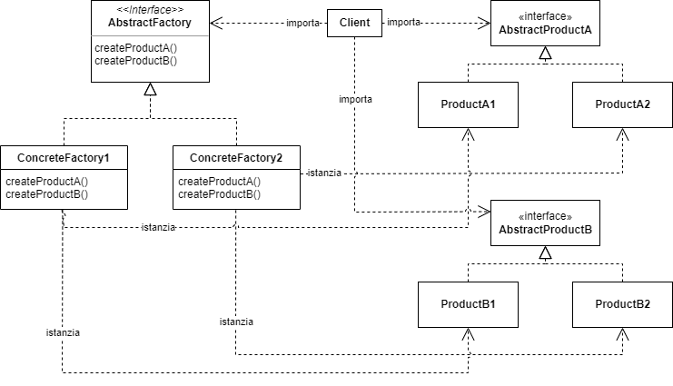

# Design pattern

I design pattern sono dei modelli di soluzione a problemi comuni di progettazione software. Esistono diversi tipi di design pattern, ma in generale si possono suddividere in 4 categorie: _creazionali, strutturali, comportamentali e architetturali_.

## Pattern creazionali

I design pattern creazionali sono quelli che si occupano di risolvere problemi relativi alla _creazione di oggetti_.

### Factory Method

Il **Factory Method** permette di creare oggetti senza specificare la loro classe concreta. Questo pattern è particolarmente utile quando abbiamo bisogno di istanziare uno o più oggetti astratti per poi effettuarvi delle operazioni che non dipendono dal loro tipo concreto (uguale per tutti gli oggetti). Come è ben noto non è possibile costruire un oggetto astratto. Per ovviare a questo problema si usa il **Factory Method** che permette al Client di specificare al metodo che dovrà effettuare tali operazioni, solo la _factory_ con cui costruire gli oggetti astratti, il metodo poi potrà lavorare con gli oggetti astratti e non sarà necessario creare un metodo diverso (che effettua le stesse operazioni) per ciascun tipo concreto, solo per avere accesso al costruttore del tipo concreto in questione.

#### UML


Nell'UML, la classe astratta `Creator`, che ha bisogno di creare un oggetto `Product`, delega la creazione ad una classe `ConcreteCreator` (che estende `Creator`). La classe `ConcreteCreator` implementa il metodo `factoryMethod()` che crea un oggetto `ConcreteProduct` (che estende `Product`).

#### Esempio

Supponiamo di voler creare un programma per creare dei documenti. Il programma deve essere in grado di creare documenti di diversi tipi (documenti di testo, di calcolo, pdf, ...) decisi a runtime dall'utente. Il programma non può prevedere che tipo di documento l'utente deciderà di creare, quindi il **Factory Method** è la soluzione migliore.

```java
public interface Document {
    public void setTitle(String title);
    ...
}

public class TextDocument implements Document {
    private String title;

    @Override
    public void setTitle(String title) {
        this.title = title;
    }
    ...
}

public class PDFDocument implements Document {
    private String title;

    @Override
    public void setTitle(String title) {
        this.title = title;
    }
    ...
}

public abstract class DocumentFactory {
    public abstract Document createDocument();
}

public class TextDocumentFactory 
extends DocumentFactory {
    @Override
    public Document createDocument() {
        return new TextDocument();
    }
}

public class PDFDocumentFactory 
extends DocumentFactory {
    @Override
    public Document createDocument() {
        return new PDFDocument();
    }
}

public class Main {
    /* Crea n documenti dello stesso tipo 
    e ne setta il titolo */
    private Document[] createNDocuments
    (int n, DocumentFactory factory) {
        Document[] documents=new Documents[n];
        for (int i = 0; i < n; i++) {
            documents[i] 
                = factory.createDocument();
            documents[i]
                .setTitle(String.valueOf(i));
        }

        return documents;
    }

    public static void main(String[] args) {
        Document[] docs;
        DocumentFactory factory;

        // Creazione di n documenti di testo
        factory = new TextDocumentFactory();
        docs = createNDocuments(10, factory);

        // Creazione di n documenti PDF
        factory = new PDFDocumentFactory();
        docs = createNDocuments(5, factory);
    }
}
```

In questo modo, il metodo nel `Main` crea n documenti allo stesso modo, senza dover conoscere il tipo di documento da creare, grazie al **Factory Method** che richiama il metodo `createDocument()`. Sarà il Client a decidere quale _factory_ inserire nel metodo `createNDocuments()`.
Senza il **Factory Method**, ci sarebbero stati diversi metodi `createNDocuments()` per ogni tipo di documento.

---

### Abstract Factory

A differenza del Factory Method, l'**Abstract Factory** permette di creare _famiglie_ di oggetti correlati senza specificare la loro classe concreta.

#### UML



In questo diagramma, si hanno 2 famiglie di oggetti: `AbstractProductA` e `AbstractProductB`, e i rispettivi prodotti concreti `ProductA1`, `ProductA2`, `ProductB1` e `ProductB2`. La classe astratta `AbstractFactory` ha bisogno di creare una famiglia di oggetti, e delega la creazione a 2 classi concrete `ConcreteFactory1` e `ConcreteFactory2`. Le classi concrete implementano i metodi `createProductA()` e `createProductB()` che creano rispettivamente un oggetto `ProductA1` o `ProductA2`, e un oggetto `ProductB1` o `ProductB2`. Il Client, che ha bisogno di creare una famiglia di oggetti, crea una classe `ConcreteFactory` e usa i metodi `createProductA()` e `createProductB()` per creare la famiglia di oggetti.

#### Esempio

Supponiamo di implementare un insieme di classi dedicate alla creazione di interfacce grafiche. I diversi elementi grafichi possono essere creati secondo stili diversi (PM e Motif). Per ogni elemento grafico viene creata una classe astratta, per ogni stile ed elemento grafico viene creata una classe concreta. Il Client deve essere in grado di modificare lo stile dell'interfaccia grafica a runtime, senza dover modificare il codice.

```java
public interface Button { /* ... */ }

public interface ScrollBar { /* ... */ }

public interface GUIFactory {
    public Button createButton();
    public ScrollBar createScrollBar();
}

public class PMButton 
    implements Button { /* ... */ }

public class PMScrollBar 
    implements ScrollBar { /* ... */ }

public class PMGUIFactory 
    implements GUIFactory {
    @Override
    public Button createButton() {
        return new PMButton();
    }

    @Override
    public ScrollBar createScrollBar() {
        return new PMScrollBar();
    }
}

public class MotifButton 
    implements Button { /* ... */ }

public class MotifScrollBar 
    implements ScrollBar { /* ... */ }

public class MotifGUIFactory 
    implements GUIFactory {
    @Override
    public Button createButton() {
        return new MotifButton();
    }

    @Override
    public ScrollBar createScrollBar() {
        return new MotifScrollBar();
    }
}

public class Main {
    public static void main(String[] args) {
        GUIFactory factory;
        Button button;
        ScrollBar scrollBar;

        // Creazione interfaccia grafica PM
        factory = new PMGUIFactory();
        button = factory.createButton();
        scrollBar = factory.createScrollBar();

        // Creazione interfaccia grafica Motif
        factory = new MotifGUIFactory();
        button = factory.createButton();
        scrollBar = factory.createScrollBar();
    }
}
```

In questo modo, il `Main` crea solo la classe `ConcreteFactory` della famiglia richiesta dall'utente e richiama i metodi generici `createButton()` e `createScrollBar()` per creare la famiglia di oggetti, ma sarà la `ConcreteFactory` a preoccuparsi di creare gli oggetti della famiglia corretta.
