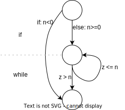

# Testing

## Testing strutturale (white-box)

Il **testing strutturale** tiene conto della struttura interna del programma con l'obiettivo di sollecitare tutte le parti del programma e, quindi, molto costoso da implementare.

### Criterio di copertura delle istruzioni

Si vuole fare in modo che ogni istruzione del programma venga eseguita almeno una volta.
Consideriamo la seguente funzione:

```java
int sqrt(int n) {
  int i = 1, z = 1;
  if(n < 0) 
    return -1;
  while(z <= n) {
    i = i + 1;
    z = i * i;
  }
  return i - 1;
}
```

Dobbiamo selezionare dei casi di testi in modo che ogni istruzione venga eseguita almeno una volta.
possiamo scegliere i seguenti casi di test:

- `n = -1` per eseguire il corpo dell'`if`
- `n = 1` per eseguire il corpo del `while`

_Osservazione_: se una funzione ha n `return` allora avremo per forza **almeno n casi di test**.

### Edge Coverage

Si vuole coprire tutte le possibili _diramazioni_ del programma. per fare ciò è utile costruire il **control flow graph** (o **CFG**) del programma in cui si evidenziono proprio tutte le diramazioni.
Nella figura seguente è riportato il CFG della funzione `sqrt` (esempio precedente):



Ogni arco rappresenta una possibile diramazione. Si noti che ogni `if` e `while` sono rappresentati da due archi, uno per il caso `true` e uno per il caso `false` (anche se ad esempio il ramo `else` non è esplicitamente presente nel codice).

Il criterio **edge coverage** vuole che ogni arco del CFG venga eseguito almeno una volta. Per fare ciò possiamo scegliere i seguenti casi di test:

- `n = -1` per eseguire solo l'arco `n < 0` (e finire il programma)
- `n = 1` per eseguire il ramo else del primo `if` e per entrare nel `while` (e quindi eseguire tutti e due gli archi del `while`)

### Criterio di copertura delle decisioni e delle condizioni

L’insieme dei casi di test deve essere definito in modo che ogni ramo del CFG venga attraversato almeno una volta e con **tutti i possibili valori** nelle sottoespressioni che compaiono nelle condizioni composte.

Per esempio, consideriamo la seguente funzione:

```java
void p(int x, int y) {
  if(x == 0 || y > 0)
    y = y/x;
  else
    y = (-y)/x;
}
```

Si può entrare nel ramo `if` nei seguenti modi: `x = 0, y <= 0` e `x != 0, y > 0`

e nel ramo `else`: `x != 0` e `y <= 0`.

Sono quindi sufficienti 3 casi di test: `x = 0, y = -1`, `x = 1, y = 1` e `x = 1, y = -1`.

### Criterio di copertura dei cammini

L’insieme dei casi di test deve garantire che ogni possibile cammino (o percorso) che porti dal nodo iniziale al nodo finale del CFG sia percorso almeno una volta.

<!--TODO: fare un esempio del criterio path coverage-->
<!--TODO: scrivere possibili "tranelli" nei TdE-->
<!--TODO: esercizio da TdE-->
